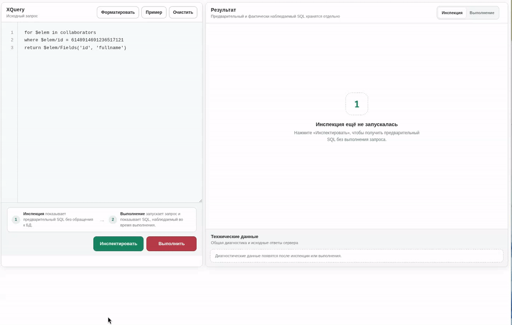

# websoft-xquery-inspector

Диагностический инструмент для просмотра SQL, который активный UniBridge-
провайдер WebSoft HCM формирует из XQuery.

Проект состоит из трёх частей:

- `XQueryInspector.dll` извлекает SQL, count SQL, параметры и служебные типы
  через reflection;
- настраиваемый шаблон WebSoft предоставляет браузерный редактор и показывает
  результат без Vue, npm, CDN и других внешних зависимостей;
- серверный агент выполняет переносимый набор проверок непосредственно внутри
  целевого WebSoft HCM и пишет обезличенный результат в отдельный журнал.

Результирующая коллекция не перечисляется, сформированный SQL не выполняется.
Транслятор при этом может выполнять служебные запросы к схеме БД.

## Демонстрация



## Проверенная совместимость

| WebSoft HCM Server | UniBridge | Провайдер | Результат |
| --- | --- | --- | --- |
| `2022.1.3.434` | `1.22.6.8` | MSSQL `1.22.6.8` | Полный протокол совместимости подтверждён |
| `2022.1.3.434` | `1.22.6.8` | PostgreSQL `1.22.6.8` | Полный протокол совместимости подтверждён |
| `2023.2.906` | `1.24.4.18` | MSSQL `1.24.4.18` | Полный протокол совместимости подтверждён |
| `2023.2.906` | `1.24.4.18` | PostgreSQL `1.24.4.18` | Полный протокол совместимости подтверждён |
| `2025.1.1132` | `1.25.3.4` | MSSQL `1.25.3.4` | Полный протокол совместимости подтверждён |
| `2025.1.1132` | `1.25.3.4` | PostgreSQL `1.25.3.4` | Полный протокол совместимости подтверждён |
| `2025.1.1333` | `1.25.3.4` | MSSQL `1.25.3.4` | Полный протокол совместимости подтверждён |
| `2025.1.1333` | `1.25.3.4` | PostgreSQL `1.25.3.4` | Полный протокол совместимости подтверждён |

На стенде подтверждена цепочка
`UniBridge → DocumentCollection → UniBridge_DocumentCollection → Query`.
Она проверена на MSSQL и PostgreSQL сборок 434, 906, 1132 и 1333;
для обоих провайдеров всех этих сборок подтверждён полный протокол.
Сборка 1515 ещё не проверена. На стенде 434
визуально подтверждено отображение
эффективного XQuery, диагностических данных, ошибки несовместимой версии
контракта и ограничение размера.

13.09.2026 обязательный набор серверного агента с DLL `1.3.0` успешно прошёл
на MSSQL и PostgreSQL сборок 434, 906, 1132 и 1333. Это подтверждает текущий
автоматизированный набор, но не заменяет ручные пункты полного
протокола. Сборка 1515 по-прежнему не проверена.

Полная матрица 5×2, причины статуса «Не проверено», обезличенные результаты и
единый протокол стендового прогона находятся в
[`compatibility/README.md`](compatibility/README.md). Статус README проверяется
автоматически против матрицы и reference-манифестов.

## Сборка из исходников

Сборка не требует npm-пакетов, сторонних NuGet-пакетов и доступа к CDN.
На сборочной машине нужны:

- Node.js `22.23.1`;
- .NET SDK feature band `10.0.1xx`: `global.json` выбирает последний
  установленный patch, проект проверен с SDK `10.0.111`;
- targeting packs `net6.0` и `net9.0`;
- Git для финальной проверки формата изменений.

Для полной проверки дополнительно нужны .NET runtime `6.0.36` и `9.0.20`.
Все команды ниже выполняются из корня клонированного репозитория.
Проверить окружение можно так:

```bash
node --version
dotnet --version
dotnet --list-runtimes
```

### Рекомендуемая сборка с проверками

Одна команда пересобирает все три поставочных артефакта и запускает
обязательные проверки:

```bash
node tools/verify.js
```

Сценарий генерирует шаблон и стендовый агент из исходных частей, выполняет
Release-сборку решения, smoke-сценарии на .NET runtime 6 и 9, контрактные тесты,
проверку матрицы совместимости, публичного состава репозитория, UTF-8 BOM, CRLF и
`git diff --check`. При первой ошибке команда останавливается с
ненулевым кодом. Если нужного runtime нет, такой запуск не считается успешной
проверкой.

Для получения артефактов без запуска тестов:

```bash
node tools/build-template.js
node tools/build-compatibility-agent.js
dotnet build src/XQueryInspector/XQueryInspector.csproj -c Release
```

Этот сокращённый вариант не подтверждает работоспособность. Для передачи в
эксплуатацию следует использовать полный `node tools/verify.js`.

### Артефакты сборки и их развёртывание

| Артефакт | Назначение | Куда устанавливать |
| --- | --- | --- |
| `src/XQueryInspector/bin/Release/net6.0/XQueryInspector.dll` | Серверная библиотека, которая извлекает SQL из UniBridge | Скопировать в `dotnetcore/tempdll/` каждого целевого экземпляра WebSoft HCM |
| `websoft/websoft-xquery-inspector.html` | Готовое содержимое браузерного интерфейса и серверного endpoint | Скопировать целиком в настраиваемый шаблон с кодом `websoft-xquery-inspector`; это не файл для каталога xHttp |
| `websoft/xquery-inspector-compatibility-agent.js` | Необязательный стендовый агент проверки DLL на конкретной сборке и провайдере | Скопировать целиком в агент сервера типа «Исполняемый код» без расписания; для штатной работы инспектора не нужен |

В `bin/Release/net6.0` также создаются `.deps.json`, `.pdb` и `.xml`. Они не
нужны для загрузки инспектора в WebSoft HCM; в `dotnetcore/tempdll/` копируется только
DLL. Файлы из `tests/**/bin` также являются только тестовыми выходами и не
развёртываются.

`websoft/websoft-xquery-inspector.html` и
`websoft/xquery-inspector-compatibility-agent.js` — генерируемые, но хранимые в Git
поставочные файлы. Вручную их не редактируют: исходники находятся в `websoft/src/`,
`websoft/src-agent/` и `compatibility/`.

Для выкладки используются DLL и шаблон. Безопасный порядок обновления: сначала
шаблон, затем DLL. После замены уже загруженной DLL нужен перезапуск целевого
экземпля WebSoft HCM. Затем на каждой комбинации сборки WebSoft HCM и SQL-провайдера
рекомендуется один ручной прогон стендового агента.

GitHub Actions выполняет ту же полную проверку командой `node tools/verify.js`
для каждого изменения в `main` и каждого pull request. При отправке тега вида
`v1.3.0` workflow после успешной проверки создаёт GitHub Release, архив
`websoft-xquery-inspector-1.3.0.zip` и файл контрольных сумм `SHA256SUMS`.
Архив содержит DLL, готовый шаблон, необязательный стендовый агент, README и
лицензию. Автоматические GitHub-архивы исходного кода не заменяют поставочный
архив, поскольку собранная DLL в Git не хранится.

Эти smoke-тесты проверяют загрузку и выполнение автономной DLL обычным .NET
host. Они не эмулируют загрузчик `Datex.Core` и не подтверждают совместимость
с конкретной сборкой WebSoft HCM; для этого нужна отдельная стендовая проверка.

## Стендовый агент совместимости

Поставочный агент находится в
[`websoft/xquery-inspector-compatibility-agent.js`](websoft/xquery-inspector-compatibility-agent.js).
Он запускается внутри WebSoft HCM, использует локальный UniBridge-провайдер и
не требует воспроизводить HTTP-аутентификацию стенда.

1. Установите проверяемую `XQueryInspector.dll` обычным способом.
2. Создайте агент сервера типа «Исполняемый код» без расписания.
3. Вставьте в него поставочный JS-файл целиком и запустите вручную.
4. Откройте отдельный журнал `xquery_inspector_compatibility` и найдите строки
   текущего запуска от `XQI|RUN|START` до `XQI|RUN|END`.
5. Стендовый прогон успешен только при `failed=0` в строке `XQI|SUMMARY`.

Не запускайте несколько экземпляров агента одновременно: они используют одно
имя отдельного журнала и независимо включают и выключают его.

Агент выполняет базовый параметрический запрос, общие сценарии
`IsHierChild()`/`IsHierChildOrSelf()`, детерминированную ошибку подготовки
XQuery и проверку верхней границы. Перед каждым фактическим вызовом пишется
`XQI|BEGIN`: последняя такая строка локализует зависший сценарий. Если позднее
появятся провайдерные сценарии, неприменимые получат `SKIP`. Проверяются
контракт, runtime-метаданные, известная reflection-цепочка, SQL и Count SQL,
параметры, длительности, этап ошибки и cleanup.

Сценарий PostgreSQL-массива, успешная трансляция запроса ровно из 200000
Unicode-кодов и отклонение синтаксической ошибки самим парсером UniBridge пока
остаются в ручном полном протоколе: некорректный XQuery может зависнуть в старом
PostgreSQL-провайдере. Агент проверяет PostgreSQL-скаляр общим параметрическим
сценарием, безопасную ошибку подготовки внутри DLL и автоматическое отклонение
200001 кода до обращения к провайдеру.

В журнал не записываются полный XQuery, SQL, JSON и значения параметров. Строки
содержат только идентификатор сценария, результат, версии, размеры и безопасные
диагностические признаки. Сам журнал и его копии нельзя добавлять в Git.

Исходные запросы находятся в [`compatibility/scenarios`](compatibility/scenarios),
а их реестр — в [`compatibility/scenarios.json`](compatibility/scenarios.json).
Для пересборки только агента без остальных проверок можно выполнить:

```bash
node tools/build-compatibility-agent.js
```

Агент подтверждает фактическую загрузку DLL, reflection, трансляцию и cleanup
на конкретном сервере, но по-прежнему не перечисляет коллекцию и не выполняет
сформированный SQL. Неизвестный runtime-путь сначала добавляется в DLL и
локальный fake-smoke сценарий, после чего прогон агента повторяется.

Имя сборки и namespace `XQueryInspector` намеренно не содержат префикс
`Websoft.` или `Datex.`. Загрузчик WebSoft HCM 434 считает такие сборки
системными и требует фирменный public key token.

## Установка DLL

1. Скопируйте
   `src/XQueryInspector/bin/Release/net6.0/XQueryInspector.dll` в
   `dotnetcore/tempdll/` нужного экземпляра. Остальные файлы из каталога
   сборки копировать не нужно.
2. Проверьте наличие `dotnetcore/tempdll` в `DOTNETLIBS-PATH` файла `xHttp.ini`.
3. При замене уже загруженной DLL перезапустите только этот экземпляр WebSoft
   HCM.

Прямой вызов из серверного SP-XML Script:

```js
var assembly = tools.dotnet_host.Object.GetAssembly(
    'XQueryInspector.dll'
)
var inspector = assembly.CreateClassObject(
    'XQueryInspector.Inspector'
)

var result = inspector.Inspect(
    tools.spxml_unibridge.Object.provider,
    "for $elem in collaborators " +
    "where $elem/id = 1111111 " +
    "return $elem/Fields('id', 'fullname')"
)

alert(result)
```

## Установка браузерного интерфейса

Поставочный шаблон находится в
[`websoft/websoft-xquery-inspector.html`](websoft/websoft-xquery-inspector.html).
Это сгенерированный tracked-файл: вручную изменяются только пять частей в
[`websoft/src`](websoft/src). Обычный `node tools/verify.js` пересобирает его
автоматически. Для пересборки только шаблона используется
`node tools/build-template.js`, а вариант с `--check` лишь проверяет
актуальность артефакта и ничего не записывает.

1. Создайте настраиваемый шаблон с кодом `websoft-xquery-inspector`.
2. Скопируйте в него файл целиком, включая серверные вставки `<% %>`.
3. Сохраните шаблон как UTF-8 with BOM. В репозитории для него зафиксированы
   BOM и окончания строк CRLF; без BOM старые версии WebSoft могут неверно
   декодировать русский текст.
4. На время разработки отключите `use_session_cache`, чтобы сессия портала не
   использовала старую скомпилированную версию.
5. Опубликуйте шаблон через маршрут своего портала и ограничьте доступ
   администраторами.

GET возвращает HTML-фрагмент интерфейса. AJAX POST отправляет поля
`action=inspect` и `xquery` напрямую на:

```text
/custom_web_template.html?object_code=websoft-xquery-inspector
```

Такой вызов возвращает JSON без HTML-обёртки портала и сохраняет штатную
проверку доступа к шаблону. XQuery ограничен 200000 Unicode-кодов: интерфейс
проверяет строку до отправки, endpoint возвращает HTTP 413 до загрузки DLL, а
`Inspector.Inspect()` повторяет ограничение для прямых серверных вызовов.

Интерфейс содержит:

- редактор с нумерацией строк, форматированием и запуском по `Ctrl+Enter`;
- ограниченную по высоте область SQL с внутренней прокруткой;
- таблицу параметров, сразу после неё раскрытый эффективный XQuery и свёрнутый
  по умолчанию Count SQL;
- служебные типы и исходный JSON;
- свёрнутую самодиагностику с версиями, reflection-цепочкой, этапом ошибки и
  серверными длительностями;
- копирование эффективного XQuery, SQL, Count SQL, TSV-таблицы параметров,
  диагностики и исходного JSON непосредственно из заголовка соответствующего
  блока.

Шаблон не создаёт собственные `html`, `head`, `body` и верхнюю шапку. Все стили
и DOM-запросы ограничены контейнером `.xqi-root`, поэтому коробочная разметка
портала не должна изменяться. Запросы и результаты не сохраняются в
`localStorage`, не журналируются автоматически и не отправляются на сторонние
ресурсы.

Интерфейс не формирует отдельный диагностический отчёт и не пытается проверять
сформированный SQL по собственным правилам.

Полный JSON, SQL, XQuery, параметры и тексты ошибок могут содержать
чувствительные данные. Перед передачей третьим лицам их необходимо проверять
вручную: доступные операции копирования не выполняют обезличивание.

## Формат результата

`Inspect()` возвращает JSON со следующими полями:

- `success` — SQL удалось извлечь, а коллекцию освободить; это не означает, что
  SQL синтаксически корректен;
- `contractVersion`, `inspectorVersion` — версия JSON-контракта и DLL;
- `providerType`, `collectionType`, `innerCollectionType`, `queryType` —
  диагностические типы;
- `providerAssemblyVersion`, `collectionAssemblyVersion`,
  `innerCollectionAssemblyVersion`, `queryAssemblyVersion` — версии доступных
  runtime-сборок;
- `queryRuntimeType`, `reflectionPath` — фактический тип Query и использованная
  цепочка доступа к команде;
- `xQuery`, `effectiveXQuery`, `sql`, `countSql` — исходный XQuery, строка после
  серверной подготовки и сформированные команды;
- `parameters` — имя, тип и значение каждого параметра;
- `failureStage`, `errorType`, `error`, `cleanupError` — этап и данные ошибок;
- `timingsMs` — длительности подготовки, трансляции, извлечения, освобождения
  коллекции и всего серверного вызова.

Текущая версия DLL — `1.3.0`, текущая мажорная версия контракта — `1`.
Обновлённый шаблон продолжает показывать legacy-ответ без версии с
предупреждением, а неизвестную версию не интерпретирует и показывает только
как исходный JSON. Безопасный порядок развёртывания: сначала шаблон, затем DLL.

Тип параметра берётся из наиболее специфичного доступного свойства провайдера:
`NpgsqlDbType` для PostgreSQL, `SqlDbType` для MSSQL, затем общего `DbType`.
Составные PostgreSQL-типы нормализуются в SQL-подобную запись: например,
`NpgsqlDbType.Array | NpgsqlDbType.Varchar` отображается как `varchar[]`, а не
как знаковое числовое значение enum. Для неизвестного провайдера сохраняется
имя runtime-типа значения параметра.

## Подготовка legacy-иерархии

В подтверждённом окружении с `UNI_CAP_BASIC` двухаргументный вызов инспектора
включает совместимую подготовку XQuery из `tools.xquery()` сборки 434. Точные
конструкции
`IsHierChild()` и `IsHierChildOrSelf()` удаляются из условия, а ID и режим `-`
или `+` переносятся в `/Hier()`. Исходный текст сохраняется в `xQuery`, а
фактически переданный провайдеру — в `effectiveXQuery`.

Это воспроизведение штатного строкового алгоритма, включая его зависимость от
регистра и пробелов, а не общий парсер иерархических выражений. Перегрузка
`Inspect(provider, xquery, useBasicHierarchyPreprocessing)` позволяет явно
передать capability. Прежний двухаргументный вызов сохранён, предполагает
`UNI_CAP_BASIC` и используется шаблоном для совместимости со старой DLL при
безопасном порядке развёртывания. Это соответствует подтверждённому окружению
MSSQL 434; небазовая ветвь `tools.xquery()` остаётся вне текущей спецификации.

Штатный алгоритм безусловно удаляет найденный `IsHierChild*()`, даже если в
запросе нет `/Hier()`. В этом случае ID некуда перенести и SQL теряет
иерархическое ограничение. Инспектор сохраняет это поведение для паритета и
показывает фактический `effectiveXQuery`; такие запросы нельзя считать
безопасными только по `success = true`.

Значения `Int64` и `UInt64` за пределами безопасного диапазона JavaScript
`±9007199254740991`, а также `Decimal`, сериализуются строками. Например:

```json
{
  "name": "p0",
  "type": "BigInt",
  "value": "6148914691236517121"
}
```

Это предотвращает округление значения при `JSON.parse()`.

## Ограничение нормализации параметров

На один вызов `Inspect()` действуют публичные пределы `Inspector`:

- до 10000 параметров команды;
- до 10000 элементов в каждом `IEnumerable`;
- до 16 вложенных enumerable;
- до 100000 нормализованных узлов суммарно;
- до 1000000 Unicode-символов в нормализованных строковых значениях суммарно;
- до 1048576 байт в одном `byte[]`.

Ссылки на enumerable отслеживаются на активной ветви, поэтому циклическая
структура также отклоняется. При превышении инспектор прекращает чтение,
возвращает `success=false` и `failureStage="read-parameters"` без частичного
списка параметров и без исходного значения в сообщении ошибки. Коллекция
UniBridge и disposable-итераторы при этом освобождаются штатно. Эти ограничения
защищают объём памяти и ответа, но не заменяют лимит времени xHttp.

## Ограничения

- Нужны активное внешнее SQL-хранилище и
  `tools.spxml_unibridge.Object.provider`.
- Reflection опирается на внутренние члены UniBridge и требует проверки на
  каждой поддерживаемой сборке.
- При `LuceneFTIndex=True` возвращается SQL до поздней подстановки результатов
  Lucene.
- Структурная оценка не заменяет парсер диалекта или серверную компиляцию SQL.
- XQuery и параметры могут содержать персональные данные; доступ к интерфейсу
  должен быть только у администраторов.

## Основания реализации

- `tools.get_object_assembly()` описывает встроенные компоненты, но не
  произвольные DLL;
- штатный `storage/sx_store_sql.xml` получает сборки через
  `tools.dotnet_host.Object.GetAssembly()`;
- `Datex.Core.CoreAssemblyLoadContext` сборки 434 проверяет public key token у
  сборок с префиксами `Datex.` и `Websoft.`;
- штатный `custom_web_template.html` сборки 434 разрешает шаблон по
  `object_code` и проверяет настроенный доступ;
- `Request.Form`, `Request.RespContentType`, `Request.SetRespStatus()` и
  `Response.Write()` являются серверными API страницы xHttp.
